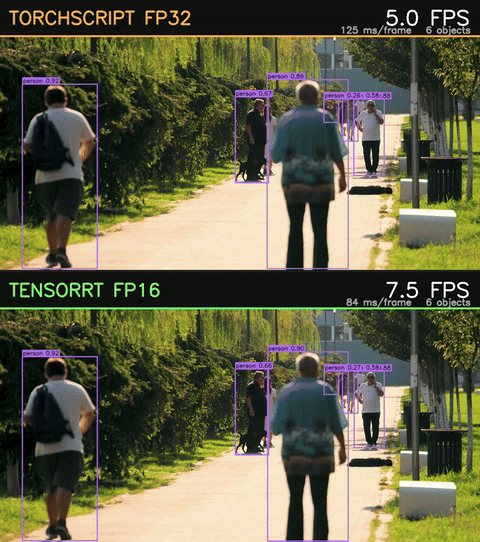

# EdgeVision — Production Edge AI Deployment on NVIDIA Jetson Nano

[](https://developer.nvidia.com/tensorrt)
[](https://developer.nvidia.com/embedded/jetson-nano)
[](https://onnx.ai/)
[](https://www.docker.com/)
[](https://documen.tician.de/pycuda/)
[](https://www.python.org/)

Taking an object detector from a PyTorch checkpoint to an optimised inference
engine on an **NVIDIA Jetson Nano 2GB** — measuring latency, accuracy, memory and
thermal behaviour at every step, with error bars.

**TensorRT FP16 runs 1.80× faster than TorchScript FP32 on the same board, with
detections agreeing to 0.1%.**



*TorchScript FP32 (top) vs TensorRT FP16 (bottom). Same model, same video, same
board — a Jetson Nano 2GB at 10 W with passive cooling and clocks locked. The FPS
counters are measured end-to-end throughput; playback is 3× real speed.*

---

## Table of Contents

- [Results](#results)
- [What this project is](#what-this-project-is)
- [Architecture](#architecture)
- [Project Structure](#project-structure)
- [Technology Stack](#technology-stack)
- [Pipeline Stages](#pipeline-stages)
- [Getting Started](#getting-started)
- [Running the Pipeline](#running-the-pipeline)
- [Benchmarking & Evaluation](#benchmarking--evaluation)
- [Findings](#findings)
- [Limitations](#limitations)
- [Roadmap](#roadmap)

---

## Results

All Jetson figures at **10 W (`nvpmodel -m 0`) with clocks locked
(`jetson_clocks`), passive cooling, fan off**, batch size 1, 640×640 input,
500 frames per run, three runs per configuration.

### Jetson Nano 2GB

| Runtime | Precision | Inference (ms) | Engine FPS | End-to-end FPS | Cold start | Detections | CV |
|---|---|---|---|---|---|---|---|
| TorchScript | FP32 | 93.15 ± 0.47 | 10.74 | 8.21 | 24.3 s | 8.33 | 0.50% |
| **TensorRT** | **FP16** | **51.76 ± 0.13** | **19.32** | **12.51** | **4.1 s** | **8.32** | **0.25%** |
| | | **1.80× faster** | **1.80×** | **1.52×** | **5.9× faster** | −0.1% | |

**Latency percentiles.** Tail latency matters more than the mean for a real-time
system — a mean of 46 ms with a p99 of 200 ms means one frame in a hundred
arrives catastrophically late.

| Runtime | Engine p50 | Engine p95 | End-to-end p50 | End-to-end p95 |
|---|---|---|---|---|
| TorchScript FP32 | 93.4 ms | 93.7 ms | 122.1 ms | 122.8 ms |
| **TensorRT FP16** | **51.7 ms** | **51.9 ms** | **79.6 ms** | **80.3 ms** |

p95 sits within **0.5%** of p50 on both runtimes. That tightness is itself a
finding about the platform: with clocks locked and nothing else running, the
Jetson produces a far more predictable frame time than the laptop, where p95 ran
30–50% above p50.

### Development laptop — RTX 3050 Laptop, i9-11900H

Reference only. Not the target platform, and see [Limitations](#limitations)
regarding the clock ceiling.

| Runtime | Precision | Inference (ms) | Engine FPS | End-to-end FPS | CV |
|---|---|---|---|---|---|
| PyTorch (CPU) | FP32 | 47.11 ± 1.72 | 21.24 | 17.45 | 3.6% |
| PyTorch (GPU) | FP32 | 13.63 ± 0.45 | 73.45 | 41.73 | 3.3% |
| PyTorch (GPU) | FP16 | 15.11 ± 0.42 | 67.51 | 41.47 | 2.8% |
| TorchScript (GPU) | FP32 | 8.33 ± 0.81 | 120.79 | 57.47 | 9.7% |

### Pipeline breakdown

Where the time actually goes. **Three of the four stages run on the CPU.**

| Stage | Laptop (GPU FP32) | Nano (TensorRT FP16) | Ratio |
|---|---|---|---|
| capture | 2.32 ms | 5.70 ms | 2.5× |
| preprocess | 6.43 ms | 13.67 ms | 2.1× |
| **inference** | **16.17 ms** | **51.76 ms** | **3.2×** |
| postprocess + NMS | 2.16 ms | 8.77 ms | 4.1× |
| **CPU share of frame** | **40%** | **35%** | |

### Decoder validation

The NumPy decoder was validated against Ultralytics on 10 frames, matched at
IoU ≥ 0.9 and same class:

| Metric | Result |
|---|---|
| Agreement | **99.2%** (117 of 118) |
| Box coordinate error, mean | **0.546 px** |
| Score error, mean | 0.018 |

Every unmatched detection fell between confidence 0.252 and 0.287, against a 0.25
threshold — borderline cases. In one frame the NumPy decoder produced three tight
boxes on three kites where Ultralytics merged them into a single box spanning the
whole scene.

### Accuracy after optimisation

To be measured on a fixed 500-image COCO subset via `pycocotools`, held constant
across every runtime. Detection counts already agree to 0.1% between FP32 and
FP16, which is suggestive but is **not** accuracy.

| Runtime | Precision | mAP@50 | mAP@50-95 | Δ vs FP32 |
|---|---|---|---|---|
| TorchScript | FP32 | — | — | baseline |
| TensorRT | FP32 | — | — | — |
| TensorRT | FP16 | — | — | — |

### Still to measure

- **mAP** on the fixed COCO subset — the table above
- **TensorRT FP32**, to separate the runtime gain from the precision gain. The
  current 1.80× mixes both changes.
- **Sustained ten-minute runs** with the thermal curve. Across three consecutive
  500-frame runs, inference crept 92.6 → 93.4 ms as the board warmed 36 → 49.5 °C
  — a 1% slowdown over 13.5 °C, and the beginning of an effect that a longer run
  should make clearer.
- **5 W vs 10 W performance-per-watt**

---

## What this project is

Most object detection projects stop at "the model works". This one starts there
and answers the questions an embedded team asks before shipping:

- **How fast is it end-to-end**, not just the engine? *(1.52× vs 1.80× — see the
  breakdown above.)*
- **How much accuracy did the optimisation cost?** *(Detections agree to 0.1%;
  mAP measurement pending.)*
- **How reproducible is the measurement?** *(CV of 0.25% on the Nano across three
  runs.)*
- **How long does it take to start?** *(4.1 s vs 24.3 s — rarely reported, and it
  matters for a service.)*

The target hardware is deliberately constrained: a Jetson Nano 2GB with a Maxwell
GPU, **no tensor cores**, no INT8, and roughly 1.4 GB of usable shared memory.
Constraints this tight make the engineering decisions visible.

**Key capabilities**

- PyTorch → ONNX → TensorRT conversion with numerical parity verified at each step
- Hand-written NumPy postprocessing — validated against Ultralytics at 99.2%
  agreement, and necessary because Ultralytics cannot run on the Nano's Python 3.6
- One benchmark harness reused across every runtime, so differences reflect the
  runtimes rather than the measurement method
- Cold start separated from steady state; engine throughput separated from
  end-to-end
- Every result carries a git commit SHA and a config hash

---

## Architecture

```
video file / IMX219 camera
        │
        ▼
  capture  (OpenCV + GStreamer / nvarguscamerasrc)
        │
        ▼
  preprocess  (letterbox 640×640, BGR→RGB, normalise, HWC→CHW)
        │
        ▼
  inference backend   ◄── TensorRT | TorchScript | ONNX Runtime | PyTorch
        │                  behind one interface, selected at runtime
        ▼
  postprocess  (decode 1×84×8400, per-class NMS — hand-written NumPy)
        │
        ├──────────────►  detection sink (JSONL; ROS2 optional)
        │
        └──────────────►  metrics exporter
                                │
                                ▼
                          Prometheus → Grafana

  systemd watchdog wraps the process (Restart=always)
```

**Where things run:**

| Laptop (Python 3.10) | Jetson Nano (Python 3.6) |
|---|---|
| Ultralytics, model export | TensorRT + PyCUDA |
| ONNX / TorchScript export | JetPack OpenCV 4.1.1 |
| COCO evaluation | torch 1.10 (NVIDIA aarch64 wheel) |
| Report generation | NumPy 1.13.3 |

---

## Project Structure

```
edgevision/
│
├── app/                              # the inference pipeline — this is what deploys
│   ├── preprocess.py                 # letterbox, BGR→RGB, normalise, HWC→CHW
│   ├── postprocess.py                # decode (1,84,8400) + per-class NMS, NumPy
│   └── backends.py                   # PyTorch / TorchScript / ONNX / TensorRT
│                                     #   behind one load()/infer() interface
├── models/
│   ├── export_to_onnx.py             # PyTorch → ONNX (fixed shape, opset 13)
│   ├── export_torchscript.py         # PyTorch → TorchScript (no Ultralytics needed)
│   ├── check_onnx.py                 # validate opset and shapes before transfer
│   ├── check_torchscript.py          # verify it loads with torch alone
│   └── build_trt_engine.py           # ONNX → TensorRT — run ON the Nano
│
├── benchmarks/                       # measurement, kept apart from what it measures
│   ├── benchmark.py                  # the harness — reused unchanged throughout
│   ├── render_demo.py                # annotated video with live FPS overlay
│   ├── compose_demo.py               # side-by-side comparison, retimed to real speed
│   └── make_report.py                # CSVs → README tables + plots
│
├── evaluation/
│   ├── validate_decoder.py           # NumPy decoder vs Ultralytics reference
│   └── coco_eval.py                  # mAP on the fixed COCO subset
│
├── tests/
│   ├── test_parity.py                # PyTorch vs ONNX numerical agreement
│   └── test_regression.py            # accuracy gate — fails CI on mAP drop
│
├── monitoring/                       # prometheus_client exporter, Grafana dashboard
├── systemd/                          # Restart=always + watchdog
├── docker/                           # Dockerfile.jetson on l4t-base r32.7.1
│
├── configs/params.yaml               # single source of configuration
│
├── docs/
│   ├── SETUP_LOG.md                  # every command, its output, and why
│   └── GIT_NOTES.md
│
├── results/                          # a deliverable, NOT gitignored
│   ├── speed.csv                     # one row per benchmark run
│   ├── speed_exploratory.csv         # earlier runs, mixed power profiles
│   ├── raw/                          # per-frame timing arrays (.npz)
│   └── README.md                     # schema and measurement protocol
│
├── data/                             # test video (gitignored)
├── assets/                           # demo GIF, comparison images
├── PROJECT_PLAN.md
├── NOTES.md                          # running build log, including what went wrong
└── README.md
```

**Why `app/`, `benchmarks/` and `evaluation/` are separate** rather than one
`src/`: they have different lifetimes. `app/` is what the Docker container
deploys. `benchmarks/` is a tool run *against* it. `evaluation/` only ever runs on
the laptop, where Ultralytics and the COCO data live. Splitting them means the
deployment image copies `app/` alone — which matters on a 2 GB board.

---

## Technology Stack

| Tool | Role |
|------|------|
| **TensorRT 8.2** | Target inference engine — the optimised path |
| **PyCUDA** | Device memory allocation and host↔device transfers |
| **TorchScript** | Frozen graph — the PyTorch baseline *on device*, since Ultralytics cannot run there |
| **PyTorch 1.10** | NVIDIA aarch64 wheel on the Nano; 2.5.1+cu121 on the laptop |
| **ONNX / ONNX Runtime** | Interchange format and cross-runtime parity checks |
| **CUDA 10.2 / cuDNN** | Pinned by JetPack 4.6; not independently upgradeable |
| **OpenCV 4.1.1 + GStreamer** | Capture and preprocessing (JetPack build, not pip) |
| **NumPy** | Hand-written box decoding and NMS |
| **Ultralytics** | Laptop only — export, and as the decoder reference |
| **Docker** | `l4t-base` runtime container, built on-device |
| **Prometheus / Grafana** | Metrics collection and dashboards |
| **systemd** | Process supervision and watchdog |
| **jetson-stats (`jtop`)** | Live thermal, power and utilisation monitoring |
| **ffmpeg** | Test video normalisation, demo composition |
| **ROS2** | Detection publishing — *optional extension, not required for v1* |

---

## Pipeline Stages

### 1. Export — `models/export_to_onnx.py`, `models/export_torchscript.py`

Fixed input shape; dynamic shapes complicate TensorRT for no benefit here.
**Opset 13** — TensorRT 8.2 supports roughly opset 13–14, and a newer opset
exports cleanly then fails at engine build.

`check_onnx.py` and `check_torchscript.py` verify the artifacts before transfer —
cheaper than discovering a problem after an 11-minute engine build on the board.

### 2. Engine build — `models/build_trt_engine.py`

**Must run on the Jetson.** TensorRT auto-tunes by timing candidate kernels on the
actual GPU, so the engine embeds choices specific to that architecture and
TensorRT version. An engine built elsewhere will not deserialise.

### 3. Inference — `app/backends.py`

All four runtimes implement `load()` and `infer()`, so `benchmark.py` never knows
which it holds. Device buffers are allocated once in `load()`, never per frame.

The TensorRT backend manages its CUDA context explicitly rather than using
`pycuda.autoinit`, which destroys the context before TensorRT's engine is
collected and segfaults on teardown.

### 4. Postprocess — `app/postprocess.py`

Decodes the raw `(1, 84, 8400)` tensor: 8400 candidates across strides 8/16/32,
each with 4 box values and 80 class scores. **No objectness column** — this is an
anchor-free head, and assuming otherwise shifts every class score by one.

Written from scratch because Ultralytics cannot run on the Nano. Validated at
99.2% agreement with 0.546 px mean box error.

### 5. Benchmark — `benchmarks/benchmark.py`

Written **before** any optimisation and reused unchanged, so differences between
results reflect the runtimes rather than the measurement method.

Separates cold start from steady state, and engine throughput from end-to-end.
Reports p50/p95, per-stage timings, sustained FPS over the final 60 s, peak
memory, temperature and power mode.

### 6. Evaluate — `evaluation/coco_eval.py`

mAP@50, mAP@50-95, precision and recall on a fixed COCO subset held constant
across every runtime, joined to speed results by config hash.

---

## Getting Started

### Prerequisites

| Item | Detail |
|---|---|
| Board | Jetson Nano 2GB Developer Kit (P3541) |
| Storage | 128 GB microSD, UHS-I U3 / V30 |
| Power | **5.1 V / 3 A USB-C** — a phone charger will brown out under load |
| Cooling | 40 mm 5 V fan (optional; all measurements here are passive) |
| Camera | Raspberry Pi Camera Module v2 (IMX219) — optional; video file works |
| Software | JetPack 4.6.x (L4T 32.7.x). The 2GB board cannot run JetPack 5 or 6. |

### 1. Clone

```bash
git clone https://github.com/RaviTejaNjr/EdgeVision.git
cd EdgeVision
```

### 2. Development machine

```bash
conda create -p venv python=3.10 -y
conda activate venv/
pip install ultralytics onnx onnxruntime-gpu onnxslim pyyaml psutil pytest
```

### 3. Jetson

```bash
# free ~320 MB by disabling the desktop
sudo systemctl set-default multi-user.target

sudo pip3 install jetson-stats                    # jtop

# reduce SD card wear
sudo sed -i 's/errors=remount-ro/noatime,errors=remount-ro/' /etc/fstab
echo "SystemMaxUse=50M" | sudo tee -a /etc/systemd/journald.conf

# GPU access inside containers by default
sudo tee /etc/docker/daemon.json > /dev/null <<'EOF'
{ "default-runtime": "nvidia",
  "runtimes": { "nvidia": { "path": "nvidia-container-runtime", "runtimeArgs": [] } } }
EOF
sudo systemctl restart docker && sudo usermod -aG docker $USER

# an interrupted bootloader upgrade bricks the board
sudo apt-mark hold nvidia-l4t-bootloader nvidia-l4t-init
```

**PyCUDA** needs build isolation disabled — it declares `numpy==1.12.1`, a 2017
release that no longer compiles against modern glibc:

```bash
export PATH=/usr/local/cuda/bin:$PATH
pip3 install --user --no-build-isolation "pycuda==2020.1"
```

**PyTorch** must come from NVIDIA's aarch64 wheel; PyPI has no Jetson build:

```bash
sudo apt-get install -y libopenblas-base libopenmpi-dev libomp-dev
wget <nvidia jetpack 4.6 torch 1.10 wheel> -O torch-1.10.0-cp36-cp36m-linux_aarch64.whl
pip3 install --user --no-deps torch-1.10.0-cp36-cp36m-linux_aarch64.whl
```

**torchvision is not required.** YOLOv5n is pure convolutions, so the TorchScript
graph contains no torchvision operators and `torch.jit.load` works with torch
alone — avoiding a 1–2 hour source compile on a 2 GB board.

See [`docs/SETUP_LOG.md`](docs/SETUP_LOG.md) for every command with its output.

---

## Running the Pipeline

```bash
# 1. Export (development machine)
python models/export_to_onnx.py
python models/export_torchscript.py

# 2. Copy to the Jetson (models and video are gitignored)
scp models/yolov5nu.onnx models/yolov5nu.torchscript \
    data/test_video.mp4 user@<jetson-ip>:~/EdgeVision/

# 3. Build the engine — ON the Jetson
python3 models/build_trt_engine.py --precision fp16

# 4. Benchmark
sudo nvpmodel -m 0 && sudo jetson_clocks
python3 benchmarks/benchmark.py --runtime tensorrt --precision fp16 \
    --frames 500 --host-profile jetson-10w-clocks-locked-fan-off \
    --clocks-locked true --fan false --notes "run 1"
```

### Demo video

```bash
# on the Jetson
python3 benchmarks/render_demo.py --runtime tensorrt   --precision fp16 --frames 300
python3 benchmarks/render_demo.py --runtime torchscript --precision fp32 --frames 300

# on the laptop, after copying the MP4s and their JSON metadata across
python benchmarks/compose_demo.py \
    --left assets/demo_torchscript_fp32.mp4 \
    --right assets/demo_tensorrt_fp16.mp4
```

---

## Benchmarking & Evaluation

**Lock the board state before measuring**, or DVFS varies clocks between runs:

```bash
sudo nvpmodel -m 0     # 10 W  (-m 1 for the 5 W comparison)
sudo jetson_clocks     # lock clocks
```

### Measurement protocol

Adopted after several measurements were silently invalidated by power state:

1. **Mains power.** Battery costs 2.6× on laptop CPU inference regardless of the
   Windows power setting.
2. **Highest performance profile**, recorded in `--host-profile`. On Windows, a
   vendor fan profile can cap GPU clocks at 10% of maximum while the OS reports
   "best performance" — verify with `nvidia-smi --query-gpu=clocks.sm`.
3. **Three runs minimum per configuration.** Two cannot establish a difference
   below roughly 15%.
4. **GPU runs before CPU runs**, so CPU load does not heat the machine.
5. On the Jetson: `nvpmodel` mode and `jetson_clocks` set and recorded.

### How results are stored

Two append-only CSVs, both committed, joined on `config_hash`. Every row records
the **git commit SHA** — suffixed `-dirty` when the working tree had uncommitted
changes — so a row cannot claim to come from code that is not what ran.

See [`results/README.md`](results/README.md) for the full schema.

---

## Findings

**The engine/end-to-end gap is large and rarely reported.** 19.32 vs 12.51 FPS on
the Nano — a 35% drop. Capture, preprocessing and NMS run on the CPU and are
unchanged by any inference optimisation.

**A prediction that failed.** CPU stages were expected to dominate on four ARM
Cortex-A57 cores, since they were already 40% of the frame on an i9. They became a
*smaller* share — 35% — because inference scaled 3.2× while CPU stages scaled only
2.1–2.5×. Postprocessing was the exception at 4.1×: NMS is a sort-and-compare loop
with no vectorisation benefit, which is what ARM does worst.

**PyTorch FP16 gave no speedup; TensorRT FP16 gave 1.80×.** Same precision change,
opposite outcomes. `.half()` converts dtypes while keeping the same layer-by-layer
execution; TensorRT selects different fused kernels and halves actual memory
traffic. On a bandwidth-bound board that is the whole game.

**The Nano is a better measurement instrument than the laptop.** CV of 0.25%
against the laptop's 2.8–7.7%. Clocks locked, nothing else running, and a power
mode that is explicit and honoured.

**Cold start differs by 5.9×** — 24.3 s for TorchScript against 4.1 s for
TensorRT. TorchScript deserialises and sets up a graph; TensorRT loads a
pre-compiled engine.

[`NOTES.md`](NOTES.md) records what went wrong as well as what worked, including
two incorrect diagnoses and a conclusion that was withdrawn and later reinstated
once enough samples existed.

---

## Limitations

Stated plainly, because a benchmark without its constraints is not a result.

- **Batch size 1 only.** With ~1.4 GB usable shared memory there is no headroom
  for batching, and single-stream latency is the metric that matters for this
  class of device.
- **No INT8 quantisation.** TensorRT's INT8 path requires compute capability 6.1
  or higher for the DP4A instruction; this board is SM 5.3.
  `platform_has_fast_int8` returns False and calibrators fail at engine build
  rather than degrading gracefully. Among Jetson platforms, INT8 begins with
  Xavier. FP16 is therefore the reduced-precision floor — a hardware constraint
  identified and documented, not an experiment left undone.
- **No tensor cores.** Maxwell supports native FP16 at 2× FP32 throughput, which
  is why FP16 helps at all — but none of the tensor-core acceleration modern
  Jetson benchmarks assume.
- **mAP not yet measured.** Detection counts agree to 0.1% between FP32 and FP16,
  which is suggestive but is not accuracy.
- **Laptop GPU clocks are capped.** The vendor power profile holds the RTX 3050
  near 1057 MHz of a 2100 MHz ceiling, and utilisation peaks around 42%. Laptop
  figures are therefore a lower bound and a reference point only; the Nano is the
  measurement target. *(The disconnected GPU fan was initially blamed, then
  measured to have no effect — the profile was the cause.)*
- **Passive cooling on all Nano measurements.** A fan is fitted but was left off
  so every run shares one thermal condition. Sustained runs with and without the
  fan are still to come.
- **JetPack 4.6 pins the stack.** CUDA 10.2, TensorRT 8.2, Python 3.6. FastAPI,
  current `transformers` and much else cannot run on-device.
- **Ultralytics cannot run on the Nano.** It requires Python 3.8+, while
  TensorRT's bindings on JetPack 4.6 are built for the system Python 3.6 only —
  mutually exclusive, and TensorRT wins. Export and COCO evaluation run on the
  laptop; postprocessing on the board is written by hand.
- **TensorRT 8.2 predates native LayerNorm support** (added in 8.6), so
  transformer architectures decompose into elementwise operations and run slower
  than the architecture warrants.
- **`peak_mem_mb` is host RSS, not GPU memory.** During a run reporting 5115 MB,
  `nvidia-smi` showed GPU memory flat at 1212 MiB.

---

## Roadmap

Tracked in [`PROJECT_PLAN.md`](PROJECT_PLAN.md).

**Next:** COCO mAP evaluation, TensorRT FP32 to separate runtime gain from
precision gain, Docker containerisation, thermal and performance-per-watt study.

**Deferred:** cross-hardware model comparison matrix, object tracking, a
transformer feasibility study on Maxwell, on-device temporal action recognition.

---

## License

MIT
