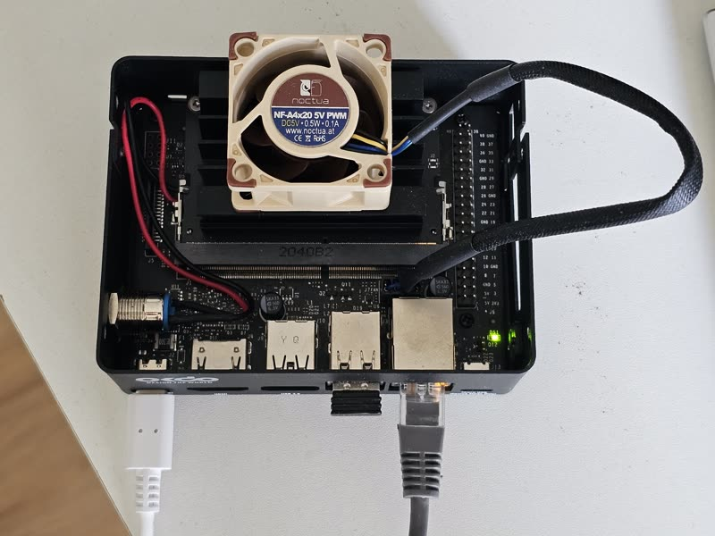
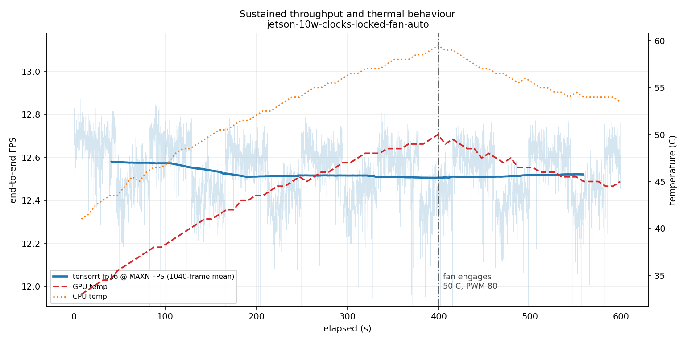
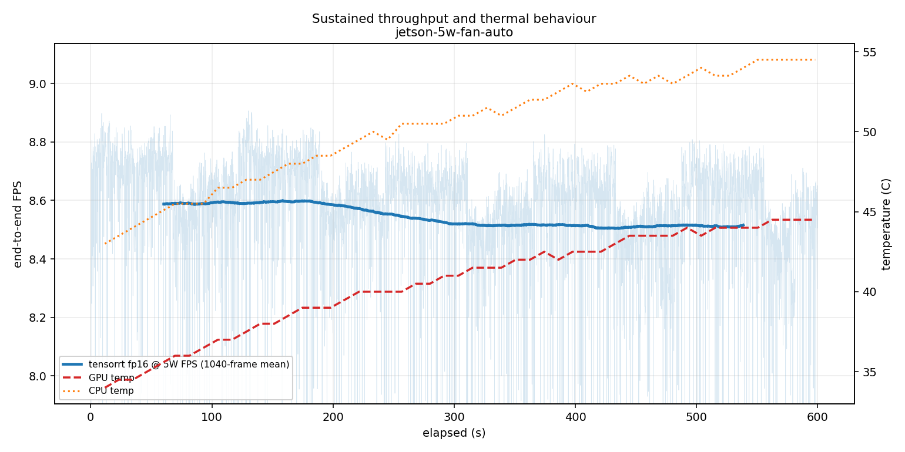

# EdgeVision - Production Edge AI Deployment on NVIDIA Jetson Nano

[](https://developer.nvidia.com/tensorrt) [](https://developer.nvidia.com/embedded/jetson-nano) [](https://onnx.ai/) [](https://www.docker.com/) [](https://documen.tician.de/pycuda/) [](https://www.python.org/) [](https://github.com/RaviTejaNjr/EdgeVision/actions/workflows/ci.yml)

EdgeVision takes an object detector from a PyTorch checkpoint to an optimized TensorRT deployment on an **NVIDIA Jetson Nano 2GB**, with latency, accuracy, memory, container overhead and thermal behavior measured along the way.



*The Jetson Nano 2GB Developer Kit used for every on-device measurement in this project.*

**TensorRT FP16 runs 1.84× faster than TorchScript FP32 on the same board, with an absolute mAP@50-95 change of 0.00032 (~0.10% relative) on the full 5,000-image COCO val2017 set.**


*TorchScript FP32 (top) vs TensorRT FP16 (bottom). Same model, video and Jetson Nano 2GB at 10 W with clocks locked. The counters show end-to-end throughput; playback is 2× real speed.*

---

## Table of Contents

- [Results](#results)
- [What this project is](#what-this-project-is)
- [Architecture](#architecture)
- [Project Structure](#project-structure)
- [Technology Stack](#technology-stack)
- [Pipeline Stages](#pipeline-stages)
- [Getting Started](#getting-started)
- [Running the Pipeline](#running-the-pipeline)
- [Benchmarking & Evaluation](#benchmarking--evaluation)
- [Findings](#findings)
- [Limitations](#limitations)
- [Roadmap](#roadmap)

---

## Results

Unless otherwise stated, the repeated runtime benchmarks below were measured at **10 W (`nvpmodel -m 0`) with clocks locked (`jetson_clocks`)**, batch size 1, 640×640 input, 500 frames per run and three runs per configuration. The fan started at PWM 0 and stock thermal management remained active. The 10-minute sustained runs use their own recorded operating-point settings.

### Jetson Nano 2GB

| Runtime | Precision | Inference (ms) | Engine FPS | End-to-end FPS | Cold start | Peak mem | CV |
|---|---|---|---|---|---|---|---|
| TorchScript | FP32 | 93.15 ± 0.47 | 10.74 | 8.21 | 24.3 s | ~1150 MB | 0.50% |
| TensorRT | FP32 | 70.89 ± 0.01 | 14.11 | 10.04 | 4.6 s | 1414 MB | **0.014%** |
| **TensorRT** | **FP16** | **50.64 ± 0.12** | **19.75** | **12.60** | **4.1 s** | **1086 MB** | 0.23% |

The speedup can be separated into the runtime change and the precision change:

| Change | Speedup | Main effect |
|---|---|---|
| TorchScript → TensorRT (FP32) | **1.31×** | TensorRT kernel selection, fusion and static memory planning |
| TensorRT FP32 → FP16 | **1.40×** | Lower precision and lower memory traffic |
| Overall: TorchScript FP32 → TensorRT FP16 | **1.84×** | 93.15 / 50.64 |

FP16 also reduced the measured peak process memory by **328 MB** compared with TensorRT FP32.

### Latency percentiles

| Runtime | Engine p50 | Engine p95 | End-to-end p50 | End-to-end p95 |
|---|---|---|---|---|
| TorchScript FP32 | 93.4 ms | 93.7 ms | 122.1 ms | 122.8 ms |
| **TensorRT FP16** | **51.7 ms** | **51.9 ms** | **79.6 ms** | **80.3 ms** |

For both on-device runtimes, p95 stayed within about 0.5% of p50 under the locked-clock benchmark setup.

### Development laptop - RTX 3050 Laptop, i9-11900H

These figures are reference measurements only; the Jetson Nano is the target platform.

| Runtime | Precision | Inference (ms) | Engine FPS | End-to-end FPS | CV |
|---|---|---|---|---|---|
| PyTorch (CPU) | FP32 | 47.11 ± 1.72 | 21.24 | 17.45 | 3.6% |
| PyTorch (GPU) | FP32 | 13.63 ± 0.45 | 73.45 | 41.73 | 3.3% |
| PyTorch (GPU) | FP16 | 15.11 ± 0.42 | 67.51 | 41.47 | 2.8% |
| TorchScript (GPU) | FP32 | 8.33 ± 0.81 | 120.79 | 57.47 | 9.7% |

### Deployment overhead - container vs bare metal

Six runs were recorded in one session, three bare-metal and three container runs, using the same `benchmarks/benchmark.py` harness.

| Metric | Bare metal | Container | Difference |
|---|---|---|---|
| Inference | 50.77 ± 0.03 ms | 50.84 ± 0.02 ms | **+0.14%** |
| End-to-end FPS | 12.57 ± 0.01 | 12.49 ± 0.02 | **-0.66%** |
| Preprocess | 13.95 ± 0.01 ms | 14.30 ± 0.04 ms | **+2.48%** |
| Peak memory | 1065 MB | 1109 MB | +4.06% |
| Detections | 8.32 | 8.32 | identical |

TensorRT inference changed by only 0.14%. Most of the measurable container difference came from preprocessing. The host uses JetPack OpenCV 4.1.1, while the container uses the Debian `python3-opencv` package, which is the likely source of that difference.

### Pipeline breakdown

| Stage | Laptop (GPU FP32) | Nano (TensorRT FP16) | Ratio |
|---|---|---|---|
| capture | 2.32 ms | 5.70 ms | 2.5× |
| preprocess | 6.43 ms | 13.67 ms | 2.1× |
| **inference** | **16.17 ms** | **51.76 ms** | **3.2×** |
| postprocess + NMS | 2.16 ms | 8.77 ms | 4.1× |
| **CPU share of frame** | **40%** | **35%** | |

The engine reaches 19.75 FPS, while the complete pipeline reaches 12.60 FPS. Capture, preprocessing and postprocessing remain part of the end-to-end cost.

### Decoder validation

The NumPy decoder was checked against Ultralytics on 10 frames using IoU ≥ 0.9 and matching class IDs.

| Metric | Result |
|---|---|
| Agreement | **99.2%** (117 of 118) |
| Box coordinate error, mean | **0.546 px** |
| Score error, mean | 0.018 |

The unmatched cases were close to the confidence threshold (0.252-0.287 with a threshold of 0.25).

### Accuracy after optimization

Full COCO val2017: **5,000 images and 36,781 annotations**, evaluated with `pycocotools` using a confidence threshold of 0.001.

| Runtime | Precision | mAP@50-95 | mAP@50 | mAP@75 | Detections | Δ mAP@50-95 |
|---|---|---|---|---|---|---|
| TorchScript | FP32 | 0.33432 | 0.50048 | 0.35289 | 530,418 | baseline |
| TensorRT | FP32 | **0.33432** | **0.50048** | **0.35290** | 530,417 | **0.00000** |
| TensorRT | FP16 | 0.33400 | 0.50047 | 0.35119 | 531,012 | **-0.00032** |

TorchScript FP32 and TensorRT FP32 match to four decimal places. TensorRT FP16 changes mAP@50-95 by 0.00032 while reducing latency and memory use.

Ultralytics publishes a higher reference figure for `yolov5nu` than this pipeline measures. This project uses its own fixed square 640×640 preprocessing and evaluation path, so the published number and the result above are not identical evaluation protocols. The important comparison here is between runtimes under the same project pipeline.

| Object size | mAP@50-95 (TensorRT FP16) |
|---|---|
| small | 0.15277 |
| medium | 0.36824 |
| large | 0.46869 |

### Sustained operating-point study

TensorRT FP16 was run continuously for 10 minutes at two Jetson operating points.

| Metric | 10 W / MAXN | 5 W |
|---|---:|---:|
| Clock state | locked (`jetson_clocks`) | unlocked |
| Frames | 7,512 | 5,118 |
| FPS first 60 s | 12.61 | 8.65 |
| FPS last 60 s | **12.49** | **8.46** |
| First-to-last degradation | **-0.94%** | **-2.11%** |
| GPU temperature | 33.0 → 45.0 °C | 34.0 → 44.5 °C |
| Maximum GPU temperature | **50.0 °C** | **44.5 °C** |
| Sustained FPS / nominal W | **1.249** | **1.692** |

At the measured 5 W operating point, the Nano sustained 8.46 FPS versus 12.49 FPS at the measured 10 W operating point. Using the configured `nvpmodel` limits, that is 1.692 versus 1.249 FPS per nominal watt.

No direct electrical power measurement was taken. These values are normalized against the configured power envelopes, not measured board power. The two sustained runs also used different clock-lock states, so this should be treated as a comparison of the two measured deployment operating points rather than an isolated `nvpmodel`-only experiment.

During the 10 W run the GPU reached **50 °C**, the stock thermal governor engaged the fan at PWM 80, and the temperature returned to about 45 °C while inference continued. The 5 W run peaked at 44.5 °C and did not trigger the fan.

<p align="center">
  
  
</p>

---

## What this project is

EdgeVision is an end-to-end deployment project for running a YOLO-family object detector on a constrained Jetson Nano 2GB. The focus is not only model conversion, but also measuring what changes when the model moves from PyTorch to TensorRT and then into a deployable container.

The project covers:

- PyTorch → ONNX → TensorRT conversion with parity checks
- TorchScript as the on-device PyTorch baseline
- Hand-written NumPy decoding and NMS for the Nano's Python 3.6 environment
- End-to-end benchmarking, including cold start and per-stage timings
- Full COCO val2017 accuracy evaluation
- Bare-metal vs Docker comparison
- Sustained thermal and 5 W / 10 W operating-point measurements
- Machine-readable JSONL detection output for downstream consumers
- GitHub Actions CI with Python syntax checks and an accuracy regression gate
- Reproducible result records using git commit SHA and configuration hashes

The target is intentionally constrained: Jetson Nano 2GB, JetPack 4.6, CUDA 10.2, TensorRT 8.2 and Python 3.6.

---

## Architecture

```text
video file / IMX219 camera
        │
        ▼
  capture  (OpenCV + GStreamer / nvarguscamerasrc)
        │
        ▼
  preprocess  (letterbox 640×640, BGR→RGB, normalise, HWC→CHW)
        │
        ▼
  inference backend   ◄── TensorRT | TorchScript | ONNX Runtime | PyTorch
        │                  behind one interface, selected at runtime
        ▼
  postprocess  (decode 1×84×8400, per-class NMS - hand-written NumPy)
        │
        ▼
  detection sink  (JSONL, one record per frame)
        │
        ▼
  downstream consumer

  systemd supervision wraps the process (boot auto-start and restart recovery verified)
```

| Laptop (Python 3.10) | Jetson Nano (Python 3.6) |
|---|---|
| Ultralytics, model export | TensorRT + PyCUDA |
| ONNX / TorchScript export | JetPack OpenCV 4.1.1 |
| COCO evaluation | torch 1.10 (NVIDIA aarch64 wheel) |
| Report generation | NumPy 1.13.3 |

---

## Project Structure

```text
edgevision/
│
├── app/
│   ├── run.py
│   ├── preprocess.py
│   ├── postprocess.py
│   └── backends.py
│
├── models/
│   ├── export_to_onnx.py
│   ├── export_torchscript.py
│   ├── check_onnx.py
│   ├── check_torchscript.py
│   └── build_trt_engine.py
│
├── benchmarks/
│   ├── benchmark.py
│   ├── render_demo.py
│   ├── compose_demo.py
│   └── make_report.py
│
├── evaluation/
│   ├── validate_decoder.py
│   └── coco_eval.py
│
├── tests/
│   ├── test_parity.py
│   └── test_accuracy_regression.py
│
├── monitoring/
├── systemd/
├── docker/
├── configs/
├── docs/
│   └── SETUP_LOG.md
├── results/
│   ├── speed.csv
│   ├── speed_exploratory.csv
│   ├── raw/
│   ├── plots/
│   └── README.md
├── data/
├── assets/
└── README.md
```

`app/`, `benchmarks/` and `evaluation/` are kept separate because they serve different purposes. `app/` is the deployable inference code, `benchmarks/` measures it, and `evaluation/` contains laptop-side validation tools.

---

## Technology Stack

| Tool | Role |
|---|---|
| **TensorRT 8.2** | Target inference engine |
| **PyCUDA** | Device memory allocation and host/device transfers |
| **TorchScript** | On-device PyTorch baseline |
| **PyTorch 1.10** | NVIDIA aarch64 wheel on Nano |
| **ONNX / ONNX Runtime** | Model interchange and parity checks |
| **CUDA 10.2 / cuDNN** | JetPack 4.6 GPU stack |
| **OpenCV 4.1.1 + GStreamer** | Capture and preprocessing |
| **NumPy** | Box decoding and NMS |
| **Ultralytics** | Laptop-side export and decoder reference |
| **Docker** | `l4t-base` deployment container |
| **GitHub Actions** | CI syntax checks and accuracy regression gate |
| **systemd** | Process supervision, boot auto-start and automatic restart |
| **jetson-stats (`jtop`)** | Thermal, power and utilization monitoring |
| **ffmpeg** | Test video normalization and demo composition |
| **ROS2** | Optional detection-publishing extension after v1 |

---

## Pipeline Stages

### 1. Export - `models/export_to_onnx.py`, `models/export_torchscript.py`

The model is exported with a fixed 640×640 input. ONNX uses opset 13 for compatibility with the TensorRT version shipped with JetPack 4.6.

`check_onnx.py` and `check_torchscript.py` verify the exported artifacts before they are copied to the Nano.

### 2. Engine build - `models/build_trt_engine.py`

TensorRT engines are built on the Jetson Nano. The builder benchmarks candidate kernels on the target GPU, so the resulting engine is tied to the target architecture and TensorRT environment.

### 3. Inference - `app/backends.py`

The runtime backends expose the same `load()` and `infer()` interface. Device buffers are allocated during `load()` and reused across frames.

The TensorRT backend manages its CUDA context explicitly instead of relying on `pycuda.autoinit`.

### 4. Postprocess - `app/postprocess.py`

The model output has shape `(1, 84, 8400)`: four box values and 80 class scores for 8,400 candidates. The decoder and per-class NMS are implemented in NumPy because Ultralytics does not run in the Nano's Python 3.6 environment.

The implementation was checked against Ultralytics with 99.2% agreement and 0.546 px mean box-coordinate error.

### 5. Benchmark - `benchmarks/benchmark.py`

The same benchmark harness is reused across runtimes. It records cold start separately from steady-state inference and reports engine latency, end-to-end latency, per-stage timing, percentiles, memory, temperature and power-mode metadata.

### 6. Evaluate - `evaluation/coco_eval.py`

The evaluation script measures COCO mAP on the full 5,000-image val2017 set using the same project preprocessing and postprocessing path for each runtime.

### 7. Detection output - `app/run.py`

The inference runner can write one JSON object per processed frame with `--sink`. Each JSONL record contains the frame number, timestamp and decoded detections (`box`, `score`, `class`).

The interface was verified on the Nano with a 20-frame TensorRT FP16 run: 20 processed frames produced 20 JSONL records, and a separate Python process parsed the file successfully.

---

## Getting Started

### Prerequisites

| Item | Detail |
|---|---|
| Board | Jetson Nano 2GB Developer Kit (P3541) |
| Storage | 128 GB microSD, UHS-I U3 / V30 |
| Power | **5.1 V / 3 A USB-C** |
| Cooling | 40 mm 5 V fan; stock thermal governor retained during sustained tests |
| Camera | Raspberry Pi Camera Module v2 (IMX219), optional |
| Software | JetPack 4.6.x (L4T 32.7.x) |

### 1. Clone

```bash
git clone https://github.com/RaviTejaNjr/EdgeVision.git
cd EdgeVision
```

### 2. Development machine

```bash
conda create -p venv python=3.10 -y
conda activate venv/
pip install ultralytics onnx onnxruntime-gpu onnxslim pyyaml psutil pytest
```

### 3. Jetson

```bash
# free memory by disabling the desktop
sudo systemctl set-default multi-user.target

sudo pip3 install jetson-stats

# reduce SD card writes
sudo sed -i 's/errors=remount-ro/noatime,errors=remount-ro/' /etc/fstab
echo "SystemMaxUse=50M" | sudo tee -a /etc/systemd/journald.conf

# make the NVIDIA runtime the Docker default
sudo tee /etc/docker/daemon.json > /dev/null <<'EOF'
{ "default-runtime": "nvidia",
  "runtimes": { "nvidia": { "path": "nvidia-container-runtime", "runtimeArgs": [] } } }
EOF
sudo systemctl restart docker
sudo usermod -aG docker $USER

# avoid accidental bootloader package changes
sudo apt-mark hold nvidia-l4t-bootloader nvidia-l4t-init
```

PyCUDA is installed without build isolation:

```bash
export PATH=/usr/local/cuda/bin:$PATH
pip3 install --user --no-build-isolation "pycuda==2020.1"
```

PyTorch uses NVIDIA's Jetson aarch64 wheel:

```bash
sudo apt-get install -y libopenblas-base libopenmpi-dev libomp-dev
wget <nvidia jetpack 4.6 torch 1.10 wheel> -O torch-1.10.0-cp36-cp36m-linux_aarch64.whl
pip3 install --user --no-deps torch-1.10.0-cp36-cp36m-linux_aarch64.whl
```

`torchvision` is not required for the exported TorchScript model used here.

See [`docs/SETUP_LOG.md`](docs/SETUP_LOG.md) for the full setup history and troubleshooting notes.

---

## Running the Pipeline

```bash
# 1. Export on the development machine
python models/export_to_onnx.py
python models/export_torchscript.py

# 2. Copy model artifacts and test video to the Jetson
scp models/yolov5nu.onnx models/yolov5nu.torchscript \
    data/test_video.mp4 user@<jetson-ip>:~/EdgeVision/

# 3. Build TensorRT on the Jetson
python3 models/build_trt_engine.py --precision fp16

# 4. Benchmark
sudo nvpmodel -m 0
sudo jetson_clocks

python3 benchmarks/benchmark.py \
    --runtime tensorrt \
    --precision fp16 \
    --frames 500 \
    --host-profile jetson-10w-clocks-locked-fan-off \
    --clocks-locked true \
    --fan false \
    --notes "run 1"
```

### JSONL detection output

The inference runner can expose detections to another process without adding a web framework:

```bash
python3 app/run.py \
    --runtime tensorrt \
    --precision fp16 \
    --frames 20 \
    --sink /tmp/edgevision_detections.jsonl
```

Each line is an independent JSON object:

```json
{"frame": 1, "timestamp": 1789903653.2286446, "detections": [{"box": [59.0, 223.0, 259.5, 716.0], "score": 0.9199, "class": "person"}]}
```

A separate Python process was used to parse the generated file, confirming that detections leave the inference process in a machine-readable format.

### systemd service

The deployment service is stored at `systemd/edgevision.service`. It runs the TensorRT FP16 inference process continuously, starts automatically at boot and restarts after an unexpected process exit.

```bash
sudo cp systemd/edgevision.service /etc/systemd/system/edgevision.service
sudo systemctl daemon-reload
sudo systemctl enable --now edgevision.service
```

Service state and runtime logs are available through systemd/journald:

```bash
systemctl status edgevision.service --no-pager
journalctl -u edgevision.service
```

The service was verified on the Nano by force-killing the inference process and confirming that systemd launched a new process, then rebooting the board and confirming that EdgeVision started automatically.

### Containerized run

The Jetson image is built on-device because it targets arm64 and PyCUDA compiles against the Jetson CUDA environment.

```bash
docker build -f docker/Dockerfile.jetson -t edgevision:latest .

docker run --rm \
    -v $(pwd)/models:/app/models \
    -v $(pwd)/data:/app/data \
    -v $(pwd)/results:/app/results \
    edgevision:latest --runtime tensorrt --precision fp16 --frames 500
```

TensorRT is supplied by the NVIDIA container runtime from the host rather than installed inside the image. Models and data are mounted instead of baked into the image.

### Demo video

```bash
# Jetson
python3 benchmarks/render_demo.py --runtime tensorrt --precision fp16 --frames 300
python3 benchmarks/render_demo.py --runtime torchscript --precision fp32 --frames 300

# laptop
python benchmarks/compose_demo.py \
    --left assets/demo_torchscript_fp32.mp4 \
    --right assets/demo_tensorrt_fp16.mp4
```

---

## Benchmarking & Evaluation

For the repeated headline benchmarks:

```bash
sudo nvpmodel -m 0
sudo jetson_clocks
```

### Measurement protocol

1. Use mains power for laptop measurements.
2. Record the active host performance profile.
3. Use at least three runs for repeated headline configurations.
4. Run GPU measurements before CPU measurements where possible.
5. On the Jetson, record `nvpmodel`, clock-lock state and fan configuration for every run.
6. Keep long-duration thermal runs separate from the repeated short benchmark protocol.

### CI accuracy regression gate

`.github/workflows/ci.yml` runs on pushes and pull requests to `main`. It checks Python syntax and runs `tests/test_accuracy_regression.py`.

The regression test reads the committed COCO results in `results/accuracy.csv` and compares TensorRT FP16 against the TorchScript FP32 reference. The allowed absolute mAP@50-95 drop is configured in `configs/params.yaml` as `0.01`. The current measured drop is `0.00032`, so the gate passes with substantial margin.

The workflow was verified on GitHub Actions for commit `fea6f22`.

### Result storage

Benchmark rows are append-only and include a configuration hash and git commit SHA. A `-dirty` suffix is added when the benchmark is run from a working tree with uncommitted changes.

See [`results/README.md`](results/README.md) for the result schema and run-level details.

---

## Findings

- **TensorRT FP16 improved on-device inference from 93.15 ms to 50.64 ms** compared with the TorchScript FP32 baseline, a 1.84× engine-level speedup.
- **End-to-end throughput improved from 8.21 to 12.60 FPS.** The smaller 1.53× end-to-end gain reflects capture, preprocessing and NMS time outside the inference engine.
- **TensorRT FP32 was useful as a control.** It matched TorchScript FP32 mAP to four decimal places, which helped verify that the conversion path was behaving as expected before introducing FP16.
- **FP16 had negligible measured accuracy impact.** mAP@50-95 changed from 0.33432 to 0.33400 on COCO val2017, an absolute drop of 0.00032.
- **Container overhead was small.** TensorRT inference differed by 0.14%, while the larger 2.48% preprocessing difference was associated with the different OpenCV builds on host and container.
- **The 10-minute 10 W run remained stable.** Throughput changed from 12.61 FPS in the first minute to 12.49 FPS in the last minute. The thermal governor engaged the fan when the GPU reached 50 °C.
- **The measured 5 W operating point sustained 8.46 FPS.** Normalized by configured power envelope, it produced 1.692 nominal FPS/W versus 1.249 at the measured 10 W operating point. This is not a direct electrical efficiency measurement.
- **Cold start was much shorter with TensorRT.** The measured startup time was 4.1 s versus 24.3 s for TorchScript.
- **Benchmark methodology mattered.** An early Docker comparison used different measurement paths for host and container. Re-running both through the same harness changed the conclusion, so later comparisons use one benchmark path.
- **TensorRT engine build conditions mattered.** Rebuilding the same model on a less-loaded board produced a measurable performance difference, so engine-build conditions are recorded with the results.
- **The inference path exposes consumable output.** `app/run.py --sink` writes one JSONL record per frame; a separate consumer successfully parsed a 20-frame TensorRT FP16 run.
- **Process supervision was verified on-device.** The systemd unit restarted EdgeVision after a forced `SIGKILL`, and the enabled service started automatically after a Nano reboot. Runtime output is captured by journald.
- **The accuracy regression gate is enforced in CI.** GitHub Actions checks Python syntax and verifies that TensorRT FP16 stays within the configured 0.01 absolute mAP@50-95 drop from the TorchScript FP32 reference.

---

## Limitations

- **Batch size is 1.** The project targets single-stream edge inference on a 2 GB Jetson Nano.
- **INT8 is not used.** The Nano's Maxwell GPU is SM 5.3 and TensorRT reports no fast INT8 path on this platform.
- **There are no tensor cores.** Results should not be compared directly with newer Jetson platforms that rely on tensor-core acceleration.
- **The evaluation path uses fixed square 640×640 preprocessing.** This differs from Ultralytics' default validation preprocessing, so the published model reference and this project's absolute mAP are not identical protocols.
- **Laptop GPU results are reference-only.** The RTX 3050 Laptop GPU was operating below its nominal clock ceiling under the available vendor power profile.
- **Sustained runs retain stock thermal management.** The 10 W run reached 50 °C and triggered the stock fan governor; the 5 W run peaked at 44.5 °C without triggering the fan.
- **JetPack 4.6 pins the software stack.** The Nano uses CUDA 10.2, TensorRT 8.2 and Python 3.6.
- **Ultralytics does not run in the Nano runtime environment.** Export and reference evaluation stay on the laptop; decoding and NMS on the Nano are implemented in NumPy.
- **The container and host use different OpenCV builds.** This is the main known difference behind the preprocessing timing gap.
- **The sustained 10 W and 5 W runs used different clock-lock states.** Their FPS/W values describe the two measured deployment operating points, not a controlled experiment that isolates only the `nvpmodel` setting.

---

## Roadmap

**Done with these:**
- runtime benchmarking
- TensorRT FP32 and FP16 deployment
- full COCO val2017 accuracy evaluation
- Docker deployment and bare-metal comparison
- sustained thermal testing
- 5 W / 10 W operating-point study
- JSONL detection sink verified with an independent consumer
- systemd process supervision, crash recovery and boot auto-start verified on the Nano
- GitHub Actions CI with Python syntax checks and accuracy regression gate
- v1.0 release scope

**Maybe Later**
- ROS2 detection publishing
- Prometheus/Grafana monitoring

**Future Scope**
- cross-hardware model comparison
- object tracking
- transformer feasibility study on Maxwell
- on-device temporal action recognition

---

## License

MIT
